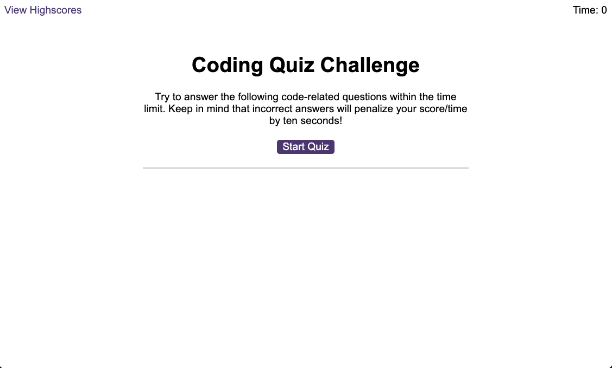
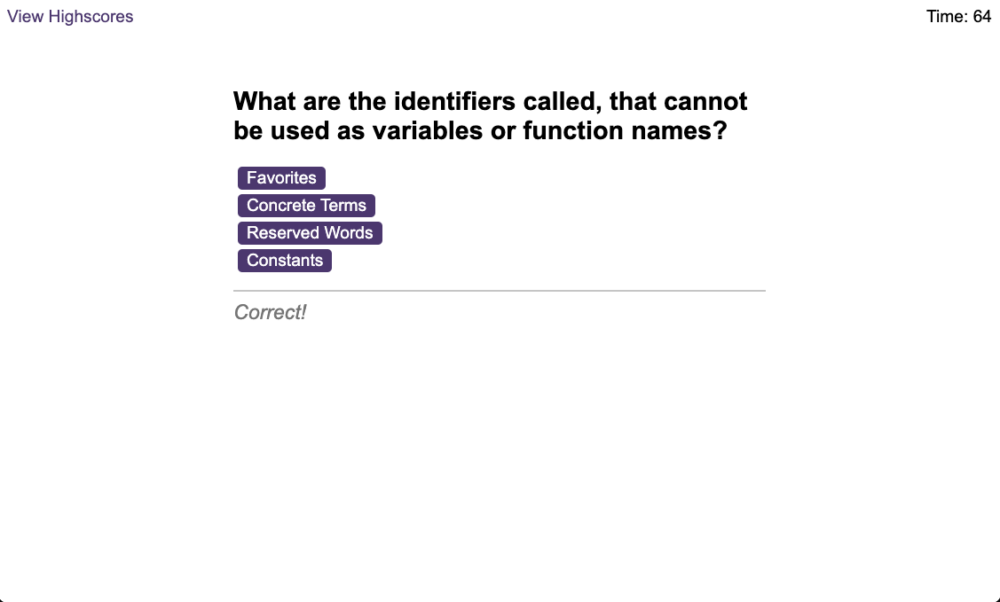
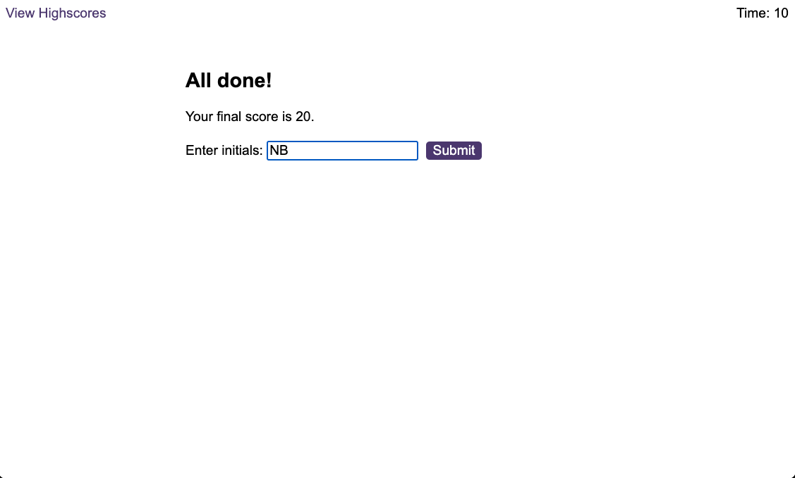
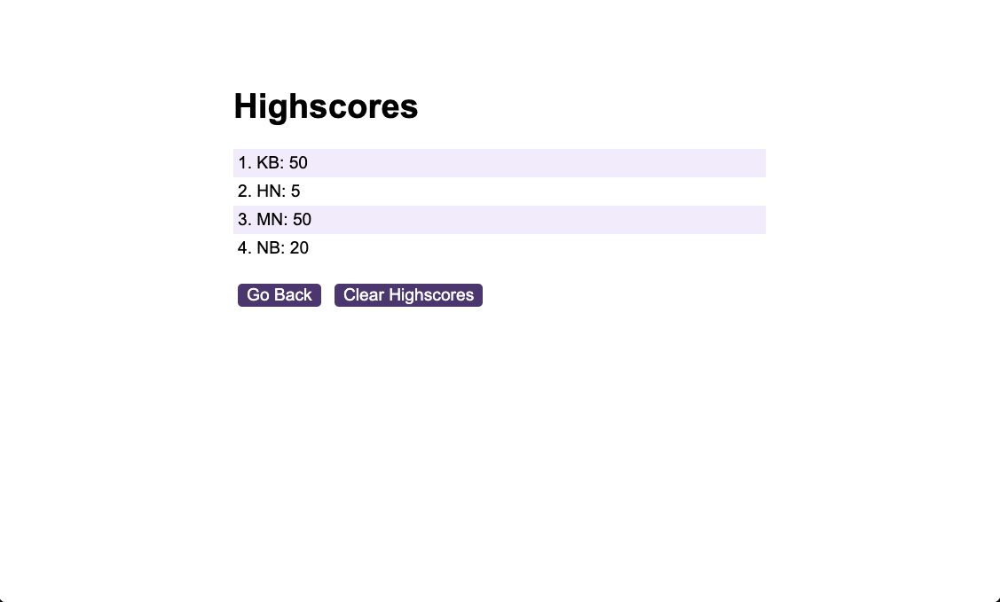

# Code Quiz

## Description

This is a quiz about JavaScript where the user has a set time to answer multiple choice questions and has the option to save the score and initials which are then displayed on another page showing the game high scores.

## Installation

No installation required.

## Usage

To access the application the user needs to navigate to [Coding Quiz](https://naike-b.github.io/Code-Quiz/index.html) .
To start the quiz the user needs to click the 'Start quiz' button.
The user has 75 seconds to answer 12 multiple choice questions. 
There are 4 available answers for each question. Only 1 answer is correct.
For every correct answer, the user gets 5 points. 
For any wrong answer the user loses 10 seconds. 
The quiz ends when the user answered all the question or the time run out. 
Then the user's final score is displayed, and the user has the option to save the score and his/her initials, clicking on the 'Submit' button.
The saved score and initials are displayed on a different page including high scores.
From here the user can go back to the start page clicking on the 'Go back button' or clear the high scores on the page clicking the 'Clear high scores' button.

This what the application looks like:

## License
Please refer to the license in the repository.

## Credits

I want to express my gratitude to my instructor, my teaching assistant, my tutor, and my study group. They were very helpful and provided me with a lot of support to finish this application.

Questions taken from [JavaScript Knowledge Quiz (Beginner)](https://www.codeconquest.com/coding-quizzes/javascript-knowledge-quiz-beginner/)

Other resources:
[JavaScript Array forEach: Executing a Function on Every Element](https://www.javascripttutorial.net/javascript-array-foreach/)
[Create an HTML button using JavaScript](https://sabe.io/blog/javascript-create-html-button)
[target Event Property](https://www.w3schools.com/jsref/event_target.asp)
[How to Play a Sound using Audio in JavaScript](https://sabe.io/blog/javascript-play-sound-audio)
[JSON](https://developer.mozilla.org/en-US/docs/Web/JavaScript/Reference/Global_Objects/JSON)
[Location: href property](https://developer.mozilla.org/en-US/docs/Web/API/Location/href)