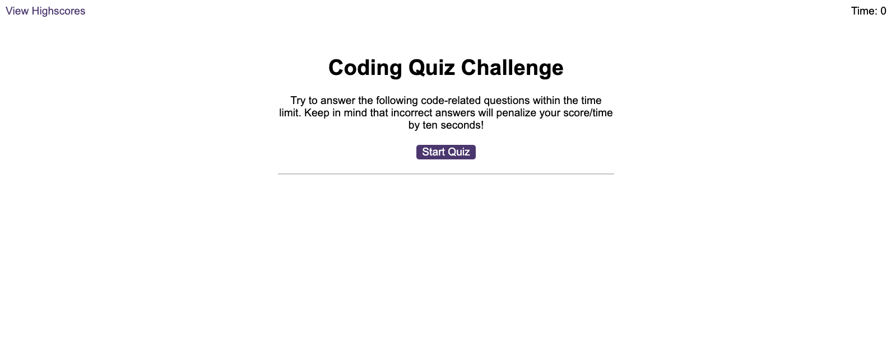
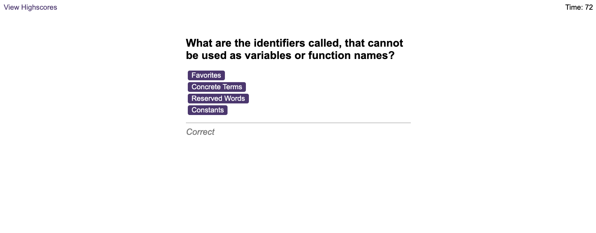
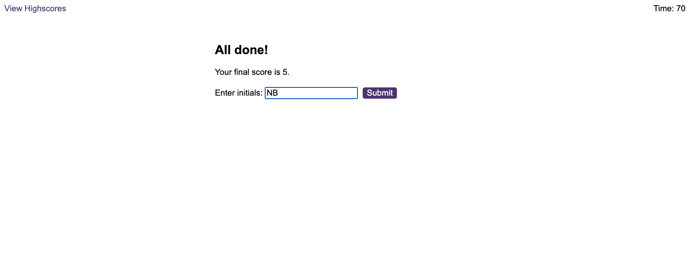

# Code-Quiz

This is a quiz about JavaScript

## Description

The user has 75 seconds to answer 12 questions. The user can choose between 4 answers. For every correct answer, the user gets 5 points. For any wrong answer the user loses 10 seconds.
At the end of the quiz the user can see the final score and add his/her initials and submit them.

## Installation

No installation required.

## Usage

Navigate to [Coding Quiz](https://naike-b.github.io/Code-Quiz/index.html)

This what the application looks like:

## License
Please refer to the license in the repo.